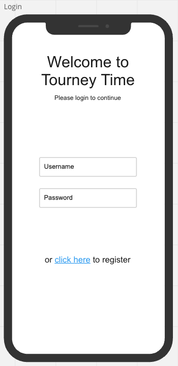
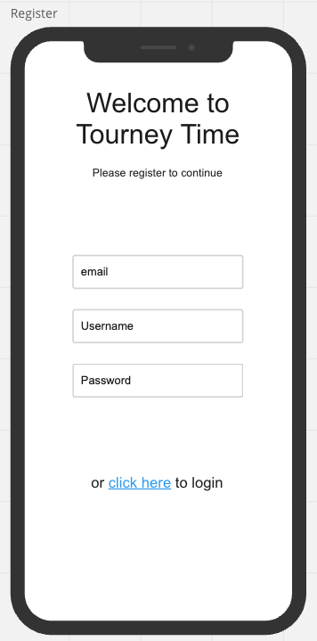
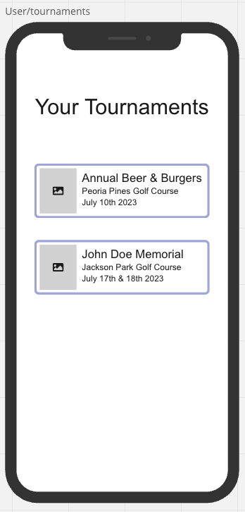
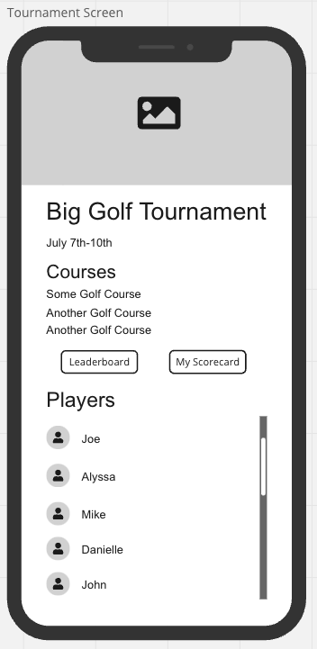
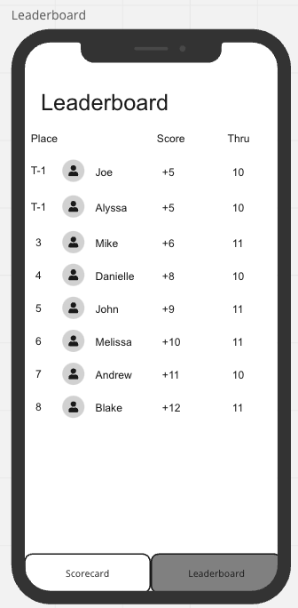
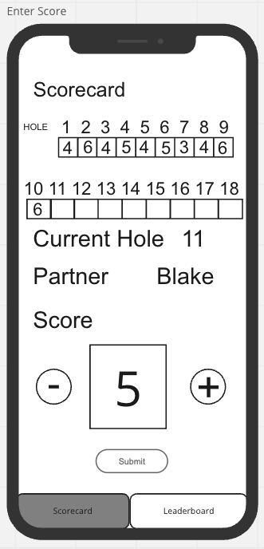
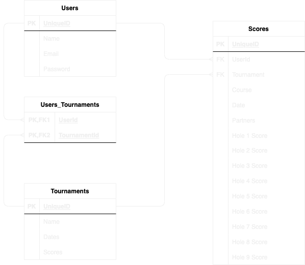

# Tourney Time
As the host of an annual golf tournament, I find myself frustrated by the lack of apps available to casual golfers for our small tournaments. While apps to manage golf tournaments and display information exist, they can often cost thousands of dollars or fall victim to a terrible user experience. As a software engineer, I now have the ability to create an app that doesn't carry the hefty price tag. 

Tourney time is an app used to help manage golf tournaments and display scores to the users. Tourney time will all users to track their golf scores for a golf tournament while also being able to see other user's scores. The front end of this app will use React build a mobile first designed app. The back end will use Django to build a postgres database and initiate user auth. 

## Techn Stack
### Backend
- Django 
- Django REST framework
- Python

### Frontend 
- React 
- Node.js
- Javascript

## Wireframes

## Sprints
- Friday - Get Django with Postgres up and running. 
- Saturday - Set up RESTful routing in Django
- Sunday - Get initial React Native app created and running in Expo. Test CRUD routes from front end. 
- Monday - Add components/views to front end in React Native. - MVP
- Tuesday - CSS
- Wednesday - Deploy
- Thursday - Deploy/Debug

## ERD

## Restful Routing
| VERB   | URL                    | CRUD   | DESCRIPTION                                | VIEW        |
|:------ |:---------------------- |:------ |:------------------------------------------ |:----------- |
| GET    | /users/:id             | Read   | Gets users profile information             |             |
| POST   | /users                 | Create | Register a new user                        |             |
| Put    | /users/:id             | Update | Update a user's profile                    |             |
| Delete | /users/:id             | Delete | Delete a user's account                    |             |
| POST   | /tournaments           | Create | Create a new tournament                    |             |
| PUT    | /tournaments/:id       | Update | Update tournament information              |             |
| DELETE | /tournaments/:id       | Delete | Delete a tournament                        |             |
| GET    | users/:id/tournaments  | Read   | Gets tournaments that the user belongs to  |             |
| GET    | tournaments/:id/users  | Read   | Gets all users that are in a tournament    |             |
| GET    | /scores/Tournament/:id | Read   | Shows all scores for a selected tournament | Leaderboard |
| GET    | /scores/users/:id      | Read   | Shows all posted scores for a user         |             |
| POST   | /scores                | Read   | Creates an entry of a score                | Scorecard   |
| Put    | /scores/:id            | Update | Updates an entry of a scorecard            | Scorecard   |
| DELETE | /scores                | Delete | Remove a scorecared                        |             |

## User Stories
As a user, I want to see players in my tournament \
As a user, I want to be able to track my scores in the app \
As a user, I want to be able to use a scorecard that tracks my score per hole \
As a user, I want to be able to see other user's scores in the same tournament \
As a user, I want to be able to see what how far players are in their round 

## MVP
- A web app built with the React framework
- A backend end that stores user data, tournament data and scores in a relational database (postgres)
- Display a live leaderboard that shows all player's current scores
- Allow users to enter their scores while playing golf

## Stretch
- Ability to post comments/images in a community thread within the tournament screen
- Add an algorithm that determines a fair distribution of groups/partners for each round
- Link an API that displays course information for each golf course
